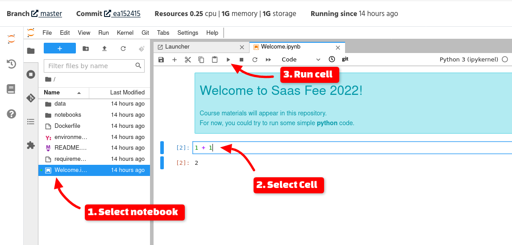

# Saas-Fee 2022 hand-on session materials

This repository will contain materials for Saas-Fee 2022 hands-on sessions.

For now, feel free to [start a session](https://renkulab.io/projects/saasfee2022/course-materials/sessions/new?autostart=1), find the *Welcome.ipynb* notebook, and experiment with it:



## Using RenkuLab

Although it is possible to start a session for quick investigation without a `renku` account, it is advisable that your create one.
This way, you will be able to see list of your session (https://renkulab.io/sessions/) and even commit your work in your own fork of the course materials repository.

Please visit  https://renkulab.io and create an account. You can also login with GitHub, ORCID, etc.

To start new session:

https://renkulab.io/projects/saasfee2022/course-materials/sessions/new?autostart=1

Note that it may take few minutes to start.
If you are using your Renku account, you can find your session later with your work preserved.

## Offline container image (slow or unavailable network)

We hope that the network capacity is sufficient to use renkulab for all sessons. But if not, we might want to resort to a fall-back option.

### Preparation before the course 

You will recieve a container image on an USB stick, including all of the needed data and software for the course.

As previously requested, every participant should have docker installed.
In addition, to avoid any dependency on the network, we ask everyone to download this small image in advance

```bash
$ docker pull odahub/saasfee22-offline-bootstrap:latest
```

Also, please download this small test image and put it in the current directory (mouse right click and "save link as" or equivalent; take care that the file is saved with the original name - some browsers add an extra extension to it, like ".txt"):

https://www.isdc.unige.ch/~savchenk/saasfee22-welcome-and-test.sif

To test that you are able to use the image, run:

```bash
$ docker run -it -v $PWD/saasfee22-welcome-and-test.sif:/image.sif -it --rm --privileged odahub/saasfee22-offline-bootstrap:latest
```

### Offline container during the course

Find where your USB stick is mounted. It should contain a large file, `saasfee22.sif`


```bash
$ docker run -it -p 8888:8888 -p 8080:8080 -v [ your usb stick directory with the image ]/saasfee22.sif:/image.sif -it --rm --privileged odahub/saasfee22-offline-bootstrap:latest
```

Then, point your browser to http://localhost:8888 to access the embedded jupyterlab with all code an materials.

**ATTENTION**!: Please note that your work in the offline container will only be preserved as long as you run the container. It is because it is difficult to ensure filesystem link between the container and your OS for all OS flavors. 
To preserve the results, you would need to download then in jupyterlab interface.
